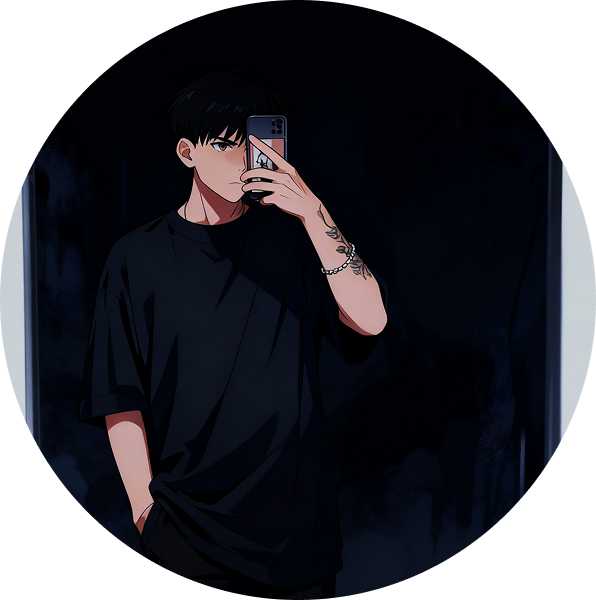

# Alisson de Almeida

  

## 👋 Bem-vindo ao meu perfil!

Sou um **Desenvolvedor Full Stack** com mais de **2 anos de experiência** na criação de soluções digitais robustas e escaláveis. Possuo também experiência em **Garantia de Qualidade (QA)** e testes, utilizando ferramentas como **UiPath**, **Selenium** e **Python** para testes automatizados e manuais.

---

## ✨ Destaques

- 🛠 **Desenvolvimento de backends seguros, robustos e escaláveis**, garantindo sistemas otimizados e funcionais.
- 🔍 **Criação de interfaces modernas, responsivas e otimizadas**, com foco em alta performance e satisfação do cliente.
- 🌱 **Diagnóstico e correção de falhas e bugs em sistemas**, implementando soluções rápidas e seguras.

---

## 🚀 Tecnologias

| 🔧 Backend         | 🎨 Frontend         | 💾 Bancos de Dados |
|--------------------|--------------------|--------------------|
| **Java Spring Boot** | **React**          | **PostgreSQL**     |
| **Python Flask**     | **Next.js**        | **MySQL**          |
|                    | **TypeScript**     |                    |

---

## 📬 Contato

Entre em contato comigo para aprimorar ou desenvolver soluções digitais personalizadas para sua empresa.

  
  
  
  

---

## 📊 GitHub Stats

  
  

