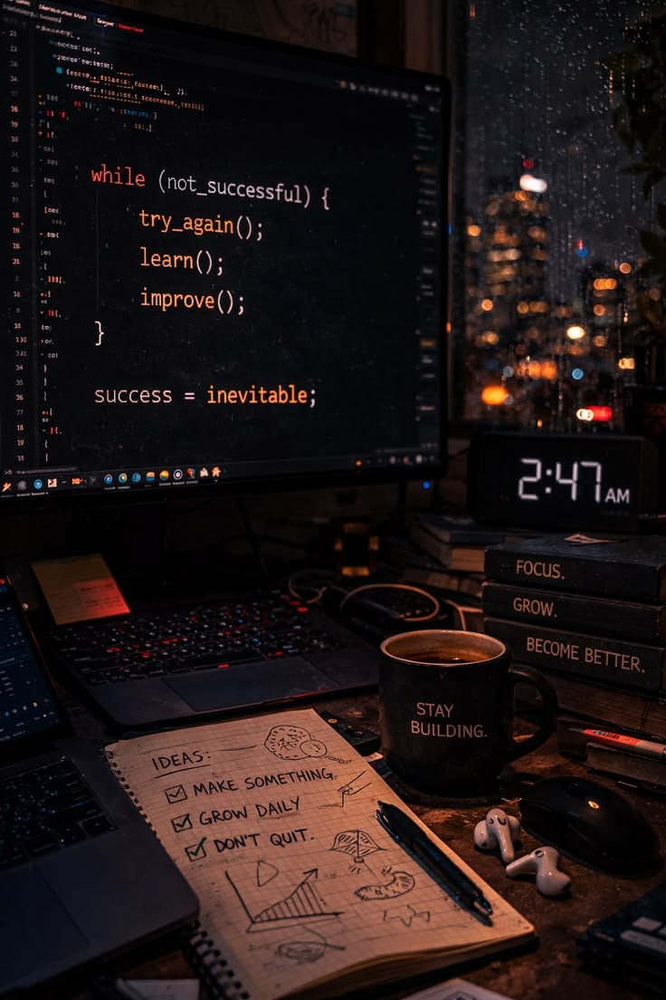

<!-- ═══════════════════════════════════════════════════════════ -->
<!--  HERO — imagem full-width como capa imersiva               -->
<!-- ═══════════════════════════════════════════════════════════ -->

<div align="center">



<br/><br/>


<br/>


<br/><br/>

[](https://devkisper.vercel.app/)
[](https://www.linkedin.com/in/alisson-almeida-de-oliveira-3406bb347/)
[](mailto:almeidadeoliveiraalisson04@gmail.com)
[](https://discordapp.com/users/706714401851310131)

</div>

<br/>

<!-- ═══════════════════════════════════════════════════════════ -->
<!--  CONTEÚDO — imagem fixa à direita, texto flui à esquerda   -->
<!-- ═══════════════════════════════════════════════════════════ -->


<table>
<tr>
<td bgcolor="#0d1117" style="border-left: 4px solid #F77F28; padding: 20px;">

**Desenvolvedor Full Stack** com **3+ anos de experiência** construindo backends escaláveis, APIs eficientes e interfaces modernas.

Foco em **arquitetura** · **performance** · **qualidade de código** · **soluções completas**

<br/>

```js
while (not_successful) {
  try_again();
  learn();
  improve();
}
success = inevitable;
```

</td>
</tr>
</table>

<br/>


<table>
<tr>
<td width="50%" valign="top" bgcolor="#0d1117" style="padding: 16px; border-top: 2px solid #DC2626;">

### ✨ devkisper.vercel.app

[](https://devkisper.vercel.app/)

Hero typewriter · Timeline animada · Carrossel infinito · Download CV · Tema neon/cyberpunk

</td>
<td width="50%" valign="top" bgcolor="#0d1117" style="padding: 16px; border-top: 2px solid #DC2626;">

### 🛠️ Stack do Site


Next.js · TypeScript · Tailwind · Vercel

</td>
</tr>
</table>

<br/>


<table>
<tr>
<td align="center" width="50%" bgcolor="#0d1117" style="padding: 18px; border-bottom: 3px solid #ff6b9d;">

### `01` Ideação

Spec-driven · TDD · SDD · Agent Skills  
Arquitetura · Modelagem · Estrutura

</td>
<td align="center" width="50%" bgcolor="#0d1117" style="padding: 18px; border-bottom: 3px solid #5eb8ff;">

### `02` Execução

Git · CI/CD · REST APIs  
Frontend · Backend · Database

</td>
</tr>
</table>

<br/>


<div align="center">

<table>
<tr>
<td align="center" bgcolor="#0d1117" style="padding: 20px;">

**Backend**


<br/><br/>

**Frontend**


<br/><br/>

**Dados · Infra**


</td>
</tr>
</table>

</div>

<br clear="right"/>

<!-- ═══════════════════════════════════════════════════════════ -->
<!--  SEÇÕES FULL-WIDTH — imagem de fundo entre blocos          -->
<!-- ═══════════════════════════════════════════════════════════ -->

<div align="center">

</div>

<br/>


<table>
<tr>
<td bgcolor="#0d1117" style="padding: 20px; border-left: 4px solid #F77F28;">

### Full Stack Developer · Rauzee
`Mar 2026 — Jul 2026` · **Latest**

Sistemas de produtividade e eficiência operacional. Otimização de fluxos de análise de crédito para correspondentes bancários.


</td>
</tr>
<tr>
<td bgcolor="#161b22" style="padding: 20px; border-left: 4px solid #8b949e;">

### Freelancer · Autônomo
`Jun 2025 — Set 2025`

Plataforma SaaS WhatsApp — estabilidade, performance e UX. Backend, UI/UX e testes de estresse.


</td>
</tr>
<tr>
<td bgcolor="#0d1117" style="padding: 20px; border-left: 4px solid #8b949e;">

### Web Developer · Freelance
`Mai 2024 — Nov 2024`

**WhaticketSaaS** — transcrição de áudio, APIs REST (Node.js, Express, TypeScript), React + PostgreSQL.


</td>
</tr>
</table>

<br/>


<table>
<tr>
<td width="33%" align="center" valign="top" bgcolor="#0d1117" style="padding: 16px;">

### FI — Finance AI
`AI · Finance` **Featured**

LLM local 5B + RAG para extratos bancários e categorização de gastos.


</td>
<td width="33%" align="center" valign="top" bgcolor="#161b22" style="padding: 16px;">

### CH — Chatbot
`AI · Chatbot`

LLM 3B + RAG para autoatendimento humanizado e empático.


</td>
<td width="33%" align="center" valign="top" bgcolor="#0d1117" style="padding: 16px;">

### RP — RPA MEI
`Automation`

Emissão de NF para MEI com Flask — 100% de precisão.


</td>
</tr>
</table>

<br/>

<div align="center">

</div>

<br/>


<div align="center">


<br/>


</div>

<br/>


<table>
<tr>
<td bgcolor="#0d1117" style="padding: 16px;">

| | |
|:---:|:---|
| 🏗️ | Full Stack com arquitetura escalável |
| 🤖 | IA local, RAG e Agent Skills |
| ⚡ | Performance e entregas spec-driven |

</td>
</tr>
</table>

<br/>


<div align="center">

### *"Aberto a novos projetos e colaborações para construir experiências digitais de alto impacto."*

<br/>

[](https://devkisper.vercel.app/)


</div>
