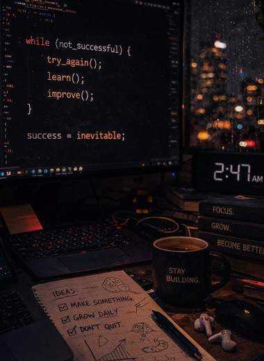

<div align="center">


<br/>


<br/>


<br/>

[](https://devkisper.vercel.app/)
[](https://www.linkedin.com/in/alisson-almeida-de-oliveira-3406bb347/)
[](mailto:almeidadeoliveiraalisson04@gmail.com)
[](https://discordapp.com/users/706714401851310131)

</div>


<table>
<tr>
<td width="58%" valign="top">

Sou **Desenvolvedor Full Stack** com mais de **3 anos de experiência** no desenvolvimento de aplicações web completas — de backends escaláveis e APIs eficientes até interfaces modernas e responsivas.

Tenho experiência em **arquitetura de software**, **otimização de performance**, **refatoração de sistemas legados** e **automação de processos (RPA)**. Também atuo com **Qualidade de Software (QA)**, utilizando **UiPath**, **Selenium** e **Python** para garantir entregas confiáveis e de alta performance.

<br/>

```js
while (not_successful) {
  try_again();
  learn();
  improve();
}
success = inevitable;
```

</td>
<td width="42%" valign="top" align="center">



*🌙 Build. Learn. Repeat.*

</td>
</tr>
</table>


<table>
<tr>
<td align="center" width="33%">

**🔐 APIs REST**  
Seguras e escaláveis

</td>
<td align="center" width="33%">

**🏗️ Full Stack**  
Arquitetura e implementação

</td>
<td align="center" width="33%">

**🤖 RPA & QA**  
Automação de testes e processos

</td>
</tr>
<tr>
<td align="center">

**🔗 Integrações**  
Sistemas e bancos de dados

</td>
<td align="center">

**⚡ Performance**  
Bugs, otimização e refatoração

</td>
<td align="center">

**🎨 UI/UX**  
Interfaces modernas e responsivas

</td>
</tr>
</table>


<div align="center">

**Backend**


<br/><br/>

**Frontend**


<br/><br/>

**Banco de Dados · Infra · QA**


</div>


<table>
<tr>
<td width="100%">

### Full Stack Developer · Rauzee
`Mar 2026 — Jul 2026`

Desenvolvimento de sistemas focados em produtividade e eficiência operacional. Otimização de fluxos de análise de crédito para correspondentes bancários, melhorando agilidade, controle e precisão dos processos de aprovação com **Laravel, Flask, React, Vue.js, Next.js e AWS**.

</td>
</tr>
<tr>
<td>

### Freelancer · Autônomo
`Jun 2025 — Set 2025`

Melhoria de plataforma SaaS baseada em WhatsApp — estabilidade, performance e UX. Correções no backend, refinamentos de UI/UX e testes de estresse para identificar gargalos e fortalecer a confiabilidade do sistema.

</td>
</tr>
<tr>
<td>

### Web Developer · Freelance
`Mai 2024 — Nov 2024`

Full Stack no projeto **WhaticketSaaS**. Módulo completo de transcrição de áudio, APIs REST com **Node.js, Express e TypeScript**, e interface React responsiva integrada com **PostgreSQL**.

</td>
</tr>
</table>


<table>
<tr>
<td width="33%" valign="top" align="center">

### FI — Finance AI
`Personal financial manager`

Processa extratos bancários via LLM local (5B) com RAG. Relatórios de receitas, despesas e categorização de gastos.

<br/>


</td>
<td width="33%" valign="top" align="center">

### CH — Chatbot Self-Service
`Autoatendimento inteligente`

Chatbot com LLM local (3B) e RAG para atendimento humanizado, com treinamento personalizado e respostas empáticas.

<br/>


</td>
<td width="33%" valign="top" align="center">

### RP — RPA Invoice MEI
`Emissão de notas fiscais`

Automação para emissão de NF para MEI com **Flask**, requests e mapeamento HTML — 100% de precisão pré-programada.

<br/>


</td>
</tr>
</table>


<div align="center">


<br/>


</div>


<div align="center">

| | |
|:---:|:---|
| 🏗️ | Desenvolvendo aplicações Full Stack com foco em arquitetura escalável |
| 🧪 | Aprimorando automação de testes e qualidade de software |
| 🔍 | Explorando novas tecnologias, performance e segurança |

</div>


<div align="center">

### 💡 *"Transformando ideias em soluções digitais eficientes."*


</div>
