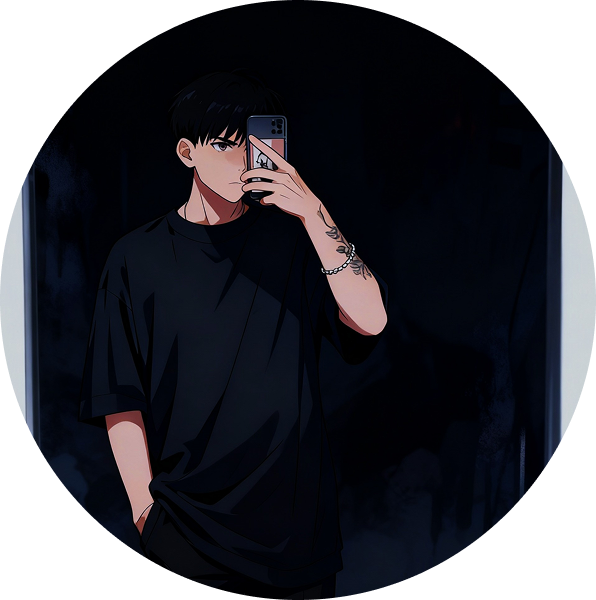
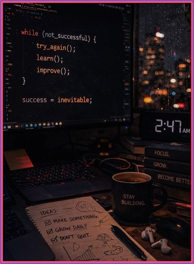
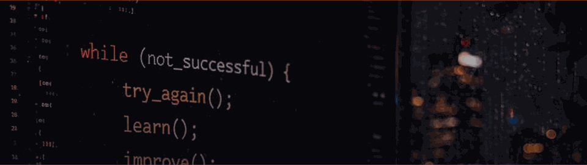

<div align="center">


<br/>


<br/>



<br/>

[](https://devkisper.vercel.app/)
[](https://www.linkedin.com/in/alisson-almeida-de-oliveira-3406bb347/)
[](mailto:almeidadeoliveiraalisson04@gmail.com)
[](https://discordapp.com/users/706714401851310131)

</div>


<table>
<tr>
<td width="58%" valign="top">

Sou **Desenvolvedor Full Stack** com mais de **3 anos de experiência** no desenvolvimento de aplicações web — de backends robustos e escaláveis, APIs eficientes e interfaces modernas e responsivas.

Foco em **arquitetura**, **performance**, **qualidade de código** e entrega de **soluções completas**. Atuo em todo o ciclo de desenvolvimento: da ideação (spec-driven, TDD, arquitetura) à execução em produção (frontend, backend, banco de dados e CI/CD).

<br/>

```js
while (not_successful) {
  try_again();
  learn();
  improve();
}
success = inevitable;
```

</td>
<td width="42%" valign="top" align="center">



*🌙 Build. Learn. Repeat.*

</td>
</tr>
</table>


<div align="center">

[](https://devkisper.vercel.app/)



</div>

<table>
<tr>
<td width="50%" valign="top">

### ✨ Características

- **Hero interativo** com efeito typewriter e parallax
- **Skills & Tools** organizadas por ciclo de desenvolvimento (ideação → execução)
- **Timeline de experiência** com cards animados e tags de tecnologia
- **Carrossel infinito** de projetos com pause ao hover
- **Contato interativo** com canais reveláveis
- **Download de CV** integrado
- Design **neon/cyberpunk** com animações e efeitos visuais

</td>
<td width="50%" valign="top">

### 🛠️ Tecnologias do Site


<br/><br/>

**Seções:** Home · About · Experience · Projects · Contact

**Destaques:** Next.js App Router · TypeScript · Tailwind CSS · Animações · Deploy na Vercel

</td>
</tr>
</table>


<table>
<tr>
<td align="center" width="50%">

### 01 — Ideação

**Spec-driven** · **TDD** · **SDD**  
**Agent Skills** · **Arquitetura**  
Definições · Modelagem · Estrutura

</td>
<td align="center" width="50%">

### 02 — Execução

**Git** · **CI/CD** · **REST APIs**  
**Frontend** · **Backend** · **Database**  
React · Next.js · Vue.js · Laravel · Flask · NestJS

</td>
</tr>
</table>


<div align="center">

**Backend**


<br/><br/>

**Frontend**


<br/><br/>

**Banco de Dados · Infra · Ferramentas**


</div>


<table>
<tr>
<td width="100%">

### Full Stack Developer · Rauzee
`Mar 2026 — Jul 2026` · **Latest**

Desenvolvimento de sistemas focados em produtividade e eficiência operacional. Otimização de fluxos de análise de crédito para correspondentes bancários, melhorando agilidade, controle e precisão dos processos de aprovação.


</td>
</tr>
<tr>
<td>

### Freelancer · Autônomo
`Jun 2025 — Set 2025`

Melhoria de plataforma SaaS baseada em WhatsApp — estabilidade, performance e UX. Correções no backend, refinamentos de UI/UX e testes de estresse para identificar gargalos e fortalecer a confiabilidade.


</td>
</tr>
<tr>
<td>

### Web Developer · Freelance
`Mai 2024 — Nov 2024`

Full Stack no projeto **WhaticketSaaS**. Módulo completo de transcrição de áudio, APIs REST com **Node.js, Express e TypeScript**, e interface React responsiva integrada com **PostgreSQL**.


</td>
</tr>
</table>


<p align="center"><i>Trabalhos selecionados em IA, automação e desenvolvimento full-stack — veja todos no <a href="https://devkisper.vercel.app/#stacks">portfólio</a>.</i></p>

<table>
<tr>
<td width="33%" valign="top" align="center">

### FI — Finance AI
`AI · Finance` · **Featured**

Gerenciador financeiro pessoal que processa extratos bancários via LLM local (5B params) com RAG. Relatórios de receitas, despesas e categorização de gastos.

<br/>


</td>
<td width="33%" valign="top" align="center">

### CH — Chatbot Self-Service
`AI · Chatbot`

Chatbot com LLM local (3B params) e RAG para atendimento humanizado, com treinamento personalizado e respostas empáticas.

<br/>


</td>
<td width="33%" valign="top" align="center">

### RP — RPA Invoice MEI
`Automation`

Automação para emissão de NF para MEI com **Flask**, requests e mapeamento HTML — 100% de precisão pré-programada.

<br/>


</td>
</tr>
</table>


<div align="center">


<br/>


</div>


<div align="center">

| | |
|:---:|:---|
| 🏗️ | Desenvolvendo aplicações Full Stack com foco em arquitetura escalável |
| 🤖 | Explorando IA local, RAG e Agent Skills em produtos reais |
| ⚡ | Aprimorando performance, qualidade de código e entregas spec-driven |

</div>


<div align="center">

### 💡 *"Aberto a novos projetos, colaborações e oportunidades para construir experiências digitais de alto impacto."*

[](https://devkisper.vercel.app/)


</div>
